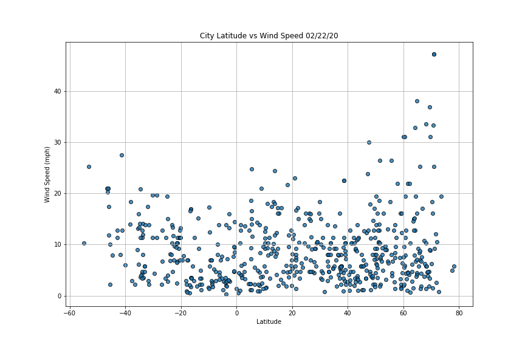
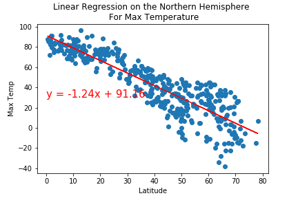

# World_Weather_Analysis

## Overview:

  Help PlanMyTrip customers find their ideal vacation spot along with hotel details based on their preferences like the weather.
  
## Details Collected:
  
  In order to help PlanMyTrip to help their customer, we randomly generated 500 latitudes and longitudes, using citipy find the city details like name, country. Using open weather API we found the max temperature, wind speed, cloudiness, humidity of all the 500 cities and stored it in a CSV file along with longitude, latitude and country code for future use.
  
## Weather data analysis:

  Created scattered chart a) Lattitude vs Max Temperature, b) Lattitude vs Humidity, c)Lattitude vs Cloudiness, d)Lattitude vs Wind Speed to see the correlation of different attributes. . Except for Lattitude vs Max Temperature, none of the other charts shows any useful correlation. As we move towards Northern Hemisphere the temperature is cooler in February while in the Equator it's warm or hot and as we move away from the equator to the Southern Hemisphere its reduces.
  
### Linear Regression based data analysis:
 
  Using Linear regression we can validate our conclusion. By calculating the slope and y-intercept we can figure out the Max Temperature for every latitude using linear regression also r-value (correlation coefficient) closer to +1 will tell if both variables are strong relationship or closer to -1 being week relationship, p-value (probability value) again proves how well the 2 variables are either related or not related based on 5% value. If the p-value is less than 5% then both variables that are getting compared are not related or the comparison is not significant. Comparing weather data in Northern Hemisphere using linear regression
  1. Max Temperature: r-value : -0.8807596156010387,  p-value:1.698585419988679e-135 (seems the variable is not significant)
  2. Humidity: r-value : 0.3768359237807389,  p-value:2.2057188721341102e-15 (though correlation coefficient is +0.37 p-value is less than 5% seems the variable is not that significant)
  3. Cloudiness: r-value : 0.2903003730407082,  p-value:1.8362698463992791e-09 (though correlation coefficient is +0.29 p-value is less than 5% seems the variable is less significant)
  4. Wind Speed: r-value : 0.12990631596543256,  p-value:0.008212263429416201 (though correlation coefficient is +0.129 p-value is less than 5% seems the variable is less significant)
  Similarly Comparing weather data in Southern Hemisphere using linear regression
  1. Max Temperature: r-value : 0.5940077699761177,  p-value:5.124494771994631e-17 (though correlation coefficient is +0.59 the p-value is insignificant)
  2. Humidity: r-value : 0.27377222536773593,  p-value:0.00038935727752737495 (though correlation coefficient is +0.27 p-value is less than 5% seems the variable is not that significant)
  3. Cloudiness: r-value : 0.2682112157983783,  p-value:0.0005159206750955315 (though correlation coefficient is +0.26 p-value is less than 5% seems the variable is less significant)
  4. Wind Speed: r-value :-0.43536742932018563,  p-value:5.675881227274614e-09 (correlation coefficient is -0.435 p-value is less than 5% seems the variable is not significant)

### Google Maps integrations for heatmap and hotels:

  For planning vacation we might need much more clarity, integrating with google maps API and creating heatmap with different variables like Max Temperature, Humidity, Cloudiness, Wind Speed would help PlanMyTrip customers plan better. We created heatmap with the 500 cities we got for our initial analysis
  
  1. Heatmap with Max Temperature 
  2. Heatmap with Humidity 
  3. Heatmap with Cloudiness 
  4. Heatmap with Wind Speed 
  
  Prompted customer with minimum temperature and maximum temperature they prefer during their vacation, based on which filtered the cities which matches the criteria and displayed in the google map. Next to plan a vacation we need hotels in those destinations using google nearby places and filtering based on lodging as the type we got hotels to stay. Now we overlayed the hotel's information in the google map as a marker so customers can look at the details 
  

## Challenge:

### Overview:
  
  Generate the weather data for 500 cities with snowfall and rainfall details which would allow the customers to filter the cities not only based on temperature but also based on rain and snow details.
  
#### Part 1:
   Created random latitude and longitude data for 500 odd cities and collected the nearest city name. Collected the weather data like Max Temperature, Humidity, Cloudiness, Wind Speed, Current Weather Description, Snowfall inches in the last 3hrs, Rainfall inches in the last 3hrs using open weather API and created a data frame and CSV file. 
   Based on data we could see at least 22 cities had snow in the last 3 hrs and 66 cities had rain in the last 3 hrs, so a total of 88 cities either had snow or rain in the last 3 hrs.

### Part 2:

   Narrowed down the search based on additional criteria on top of minimum temperature and maximum temperature like whether you want it raining and/or snowing. Based on those criteria further filtered the cities which met the criteria and saved the search as a CSV  
   
### Part 3:
  
  In the above filtered preferred city list picked 4 of the cities for a vacation. To plan for vacation we had got the directions from starting point to ending point assuming the travel mode for this vacation is driving. For this vacation, we have selected Catamarca in Argentina, Coquimbo, Constitucion, Talcahuano in Chile . Also the following is the map with additional details about the hotel to stay during the vacation 
